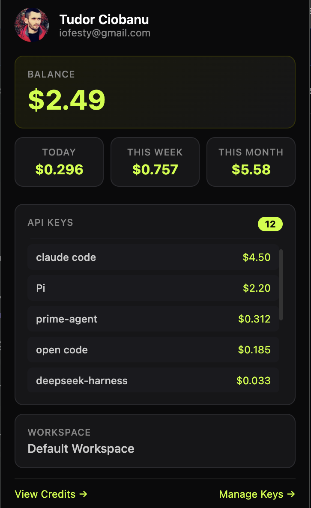

# OpenRouter Account Status

A Chrome extension that displays your OpenRouter account status directly in a popup — **no API key required**. Just click the icon and see your balance, usage, and API keys at a glance.



## Features

- **Account Balance** — See your current credit balance in real-time
- **Usage Tracking** — View your spending for today, this week, and this month
- **API Keys Overview** — All your API keys sorted by total usage, with the top spenders highlighted
- **Workspace Info** — See which workspace you're connected to
- **Quick Links** — Jump directly to OpenRouter's credits page or key management

## How It Works

The extension uses the same internal APIs that [openrouter.ai](https://openrouter.ai) uses when you're logged in. It reads your session cookies to authenticate — **no API key or token needed**. Your credentials never leave your browser.

### Data Sources

| Data | Source |
|------|--------|
| User info (name, email, avatar) | `/api/frontend/v1/private/users/current` |
| Workspaces | `/api/frontend/v1/private/user/workspaces` |
| API keys & usage | `/api/frontend/v1/private/workspace-api-keys` |
| Account balance | Scraped from `/settings/credits` page |

## Installation

### From Source (Developer Mode)

1. Clone or download this repository
2. Open Chrome and navigate to `chrome://extensions`
3. Enable **Developer mode** (top-right toggle)
4. Click **Load unpacked**
5. Select the `openrouter_extension` folder
6. The OpenRouter icon appears in your toolbar

### Usage

1. Log in to [openrouter.ai](https://openrouter.ai) in Chrome
2. Click the OpenRouter extension icon in the toolbar
3. Your account status loads automatically

> **Note:** You must be logged in to OpenRouter in your Chrome browser for the extension to work.

## Permissions

| Permission | Purpose |
|------------|---------|
| `cookies` | Read your OpenRouter session cookie for authentication |
| `host_permissions: openrouter.ai/*` | Make API calls to OpenRouter's frontend endpoints |

The extension only communicates with `openrouter.ai` and does not collect or transmit any data to third parties.

## Tech Stack

- Chrome Extension Manifest V3
- Vanilla JavaScript (no frameworks)
- CSS custom properties for theming
- Background service worker for API calls

## Project Structure

```
openrouter_extension/
├── manifest.json        # Extension manifest (MV3)
├── background.js        # Service worker — handles all API calls
├── content.js           # Content script
├── popup.html           # Popup UI
├── popup.css            # Dark theme styling
├── popup.js             # Popup logic & data fetching
└── icons/
    ├── icon16.png       # Toolbar icon (16x16)
    ├── icon48.png       # Extensions page icon (48x48)
    └── icon128.png      # Store icon (128x128)
```

## Privacy

- ✅ No data is collected or sent to third parties
- ✅ No API keys or tokens are stored
- ✅ Only communicates with `openrouter.ai`
- ✅ Uses your existing browser session (no additional login required)
- ✅ Open source — inspect the code yourself

## License

MIT
